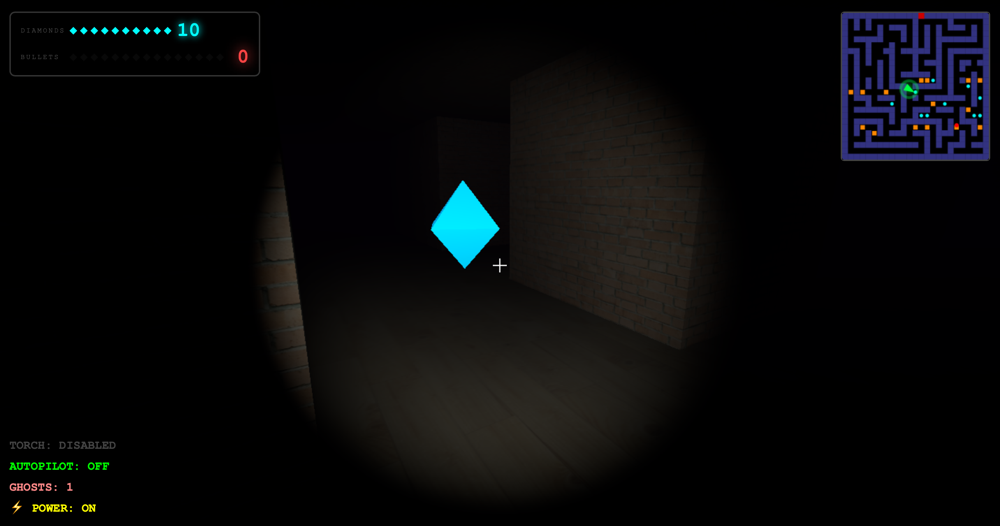
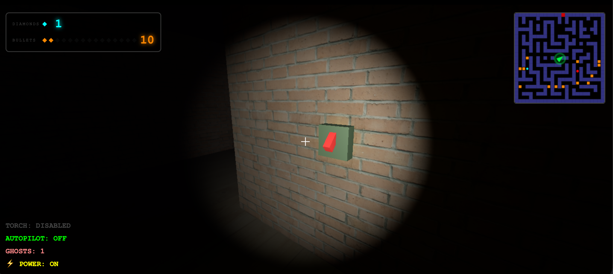
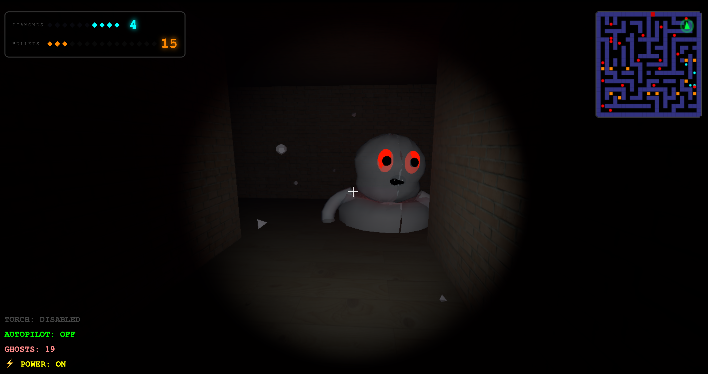
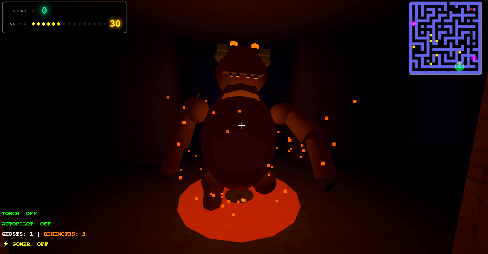
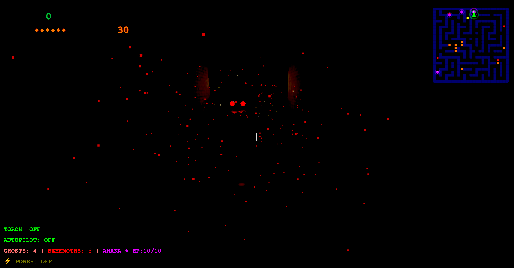
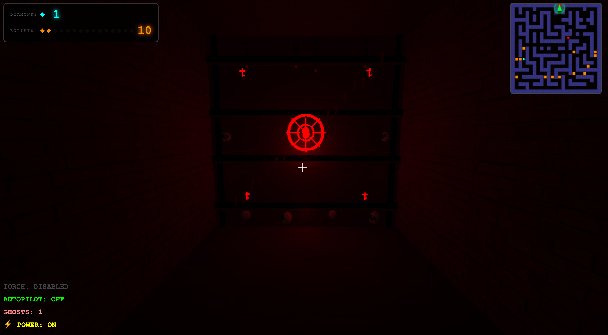
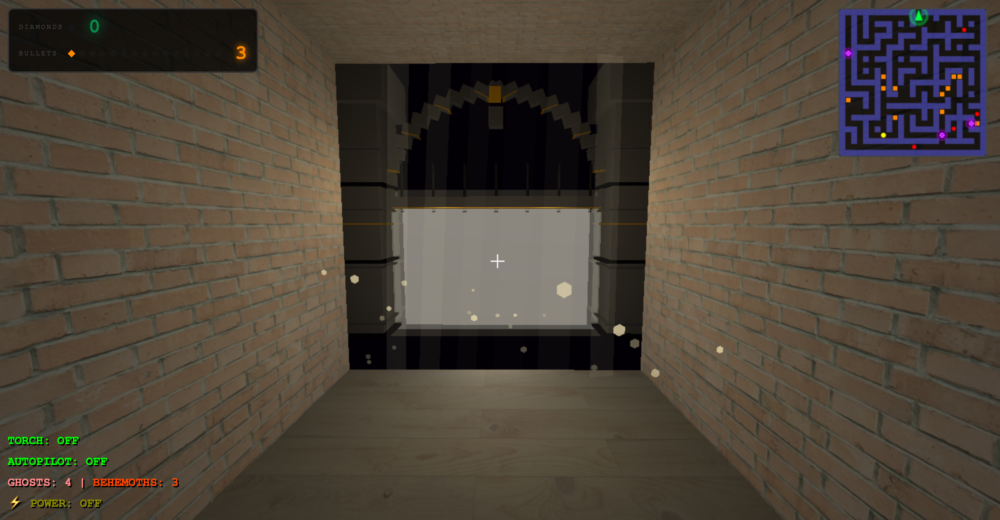

<div align="center">

# CURSED HAUL

**A first-person 3D horror maze — built entirely in a single HTML file.**


[](LICENSE.md)
[](https://threejs.org/)
[](#zero-build-architecture)

<br>


*You are not alone in here.*

</div>

---

## The Premise

You wake up inside a pitch-black maze. No map, no light, no way out — yet. Somewhere in the darkness, **5 diamonds** are hidden across the corridors. They were stolen relics, and you need them all. Find the power switch to illuminate your path. Scavenge bullet cases to arm yourself. Collect every diamond to unseal the exit gate.

But every diamond you grab draws the ghosts closer. And the moment you collect the last one, something far worse wakes up.

**Collect. Survive. Escape.**

[](https://fahim715.github.io/cursed-haul-src/)
---

## Gameplay

<div align="center">



*Each diamond you collect brings you closer to freedom — and closer to danger.*

</div>

The maze is procedurally generated on every run using a **Depth-First Search** algorithm, so no two sessions are the same. Your objective is straightforward: find all 5 diamonds, unlock the gate, and escape. The execution is anything but.

- The maze starts completely dark. Your torch has limited utility, and certain enemies can suppress it entirely.
- A **Power Switch** is hidden somewhere in the maze. Activating it lights up the entire level and makes navigation dramatically easier — but you have to find it first.
- **Bullet cases** are scattered throughout. Each yields 5 rounds. Managing your ammo is critical, especially in the late game.

<div align="center">



*The Power Switch. Find it. Use it. Everything becomes clearer.*

</div>

---

## The Enemies

### Ghosts

<div align="center">



*They know the maze better than you do.*

</div>

Ghosts haunt the corridors from the moment you start. They navigate using **Breadth-First Search** pathfinding, always finding the optimal route toward you. They are fast, persistent, and multiply with every diamond you collect. In the early game, a single ghost is manageable. By the time you have four diamonds in hand, you will be fighting through crowds.

---

### Behemoths

<div align="center">



*When all 5 diamonds are collected, 3 of these awaken.*

</div>

The screen flashes. The warning sounds. **Three Behemoths spawn** the instant you collect the final diamond. They are slower than ghosts but built to absorb punishment — each one requires **4 bullets** to kill. They emit an orange ground glow and fill the corridors with heat and dust. You cannot outrun them forever.

---

### Ahaka

<div align="center">



*It stands between you and the exit. It takes 10 bullets to kill. Your torch means nothing here.*

</div>

Ahaka is the final obstacle. It takes position at the exit gate the moment the Behemoths awaken, and it projects a **darkness aura** that disables your torch and suppresses all ambient lighting in its vicinity. It takes **10 bullets** to kill — more than any other enemy in the game. You can try to bypass it, but the gate is narrow and Ahaka does not move.

---

## The Gate

<div align="center">




<br>

*Five diamonds. One gate. The darkness does not open for the empty-handed.*

</div>
The exit gate remains sealed until every diamond is in your possession. Once they are, the bars lift — but so does the threat level. The gate is your finish line and your final confrontation point. Reach it, clear Ahaka, and walk through.

---

## Controls

| Key | Action |
|-----|--------|
| `W A S D` | Move |
| `Shift` | Sprint |
| `Mouse` | Look around |
| `T` | Toggle torch |
| `F` or `Left Click` | Shoot |
| `E` | Interact with Power Switch |
| `C` | Toggle Autopilot (BFS pathfinding demo) |
| `R` | Restart / Reset |

---

## HUD Reference

**Top-left panel** — Tracks your current diamond count (cyan pips) and bullet count (orange pips) with a numeric readout.

**Bottom-left overlay** — Live status display:

- **TORCH** — `OFF` / `ON` / `DISABLED` (suppressed inside Ahaka's aura)
- **AUTOPILOT** — BFS-driven pathfinding mode
- **GHOSTS** — Active ghost count; **BEHEMOTHS** count appended after they spawn; **AHAKA HP** shown once it is present
- **POWER** — Whether the maze power switch has been activated

**Top-right minimap** — Full maze layout with your position (green triangle), diamonds (cyan), bullet cases (orange), and enemy markers updated in real time.

---

## Technical Highlights

Cursed Haul was built as a technical exercise — a complete, playable 3D horror game with no dependencies, no build step, and no asset files beyond the HTML itself.

### Procedural Generation and AI

- **Maze Generation** — Randomized DFS carving on a 25×25 grid guarantees a unique, solvable layout every session.
- **Enemy AI and Autopilot** — All pathfinding (ghost AI, Behemoth pursuit, and the player autopilot feature) runs on real-time **BFS** over the maze graph.

### Rendering and Performance

- **Instanced Mesh Rendering** — All maze walls are batched into a single `THREE.InstancedMesh` draw call, keeping frame rates stable across the entire 25×25 grid.
- **Custom Procedural Geometry** — Enemies are modelled entirely in code using `LatheGeometry`, `TubeGeometry`, and Catmull-Rom spline curves. No external model files are loaded.
- **Per-frame Animation** — Enemy materials (opacity, emissive intensity, color) are animated each frame via delta time for fluid, organic movement.

### Synthesized Audio — No Audio Files

Every sound in the game is generated at runtime using the **Web Audio API**:

- `OscillatorNode` — Base tone generation for ambient and monster sounds
- `BiquadFilterNode` — Frequency shaping for horror atmosphere
- `WaveShaperNode` — Non-linear distortion for growls and screeches
- `ConvolverNode` — Reverb simulation for spatial depth

### Zero-Build Architecture

The entire project ships as a **single `.html` file**. Three.js is loaded via an **ES6 Import Map** pointed at a CDN, with no Node.js, npm, or bundler required.

```html
<script type="importmap">
  { "imports": { "three": "https://unpkg.com/three@0.160.0/build/three.module.js" } }
</script>
```

---

## Getting Started

Because the game uses `<script type="module">`, browsers restrict direct `file://` access. Serve it over HTTP:

**Python**
```bash
python3 -m http.server 8000
# Open http://localhost:8000
```

**Node.js**
```bash
npx serve .
```

**VS Code** — Right-click `index.html` and select **Open with Live Server**.

Or just [play it in the browser](https://fahim715.github.io/cursed-haul-src/) — no setup needed.

---

## Browser Compatibility

| Browser | Status |
|---------|--------|
| Chrome / Edge | Fully supported |
| Firefox | Fully supported |
| Safari | Requires a recent version (ES6 Import Maps) |
| Mobile | Not supported — keyboard and mouse required |

---

## License

Licensed under the **MIT License** — see [LICENSE.md](LICENSE.md) for details.

---

<div align="center">

Built with vanilla JavaScript and Three.js.

[**Play Now**](https://fahim715.github.io/cursed-haul-src/)

</div>
